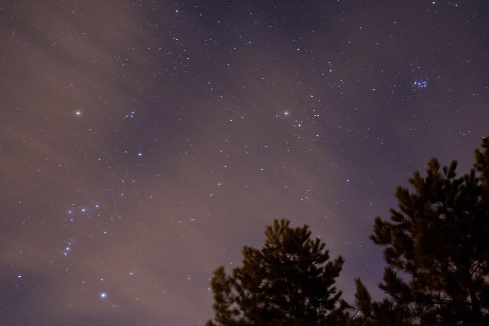
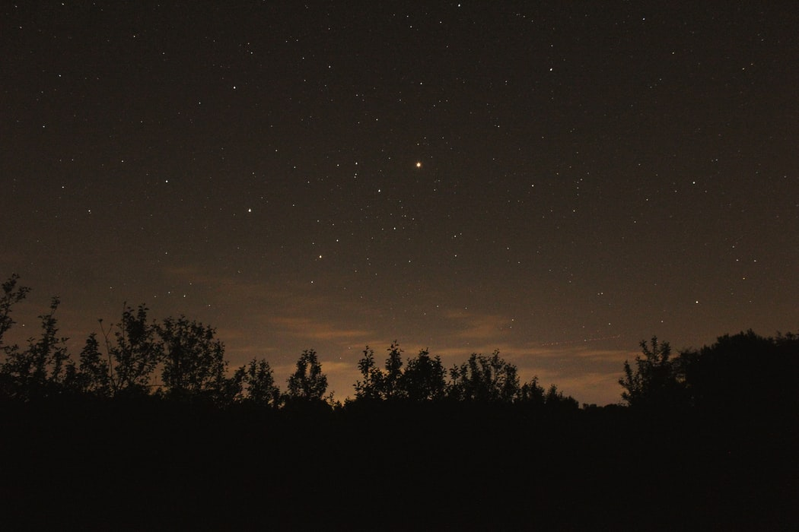
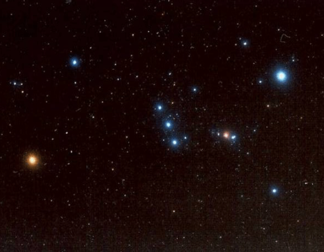
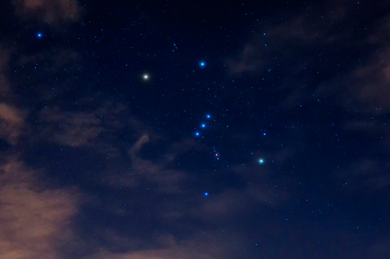

# Star Recognizer
Final Project of the discipline SCC0251/5830 Digital Image Processing

## Students
Ana Laura Chioca Vieira - 9866531 
Ana Luiza Teixeira Costa - 11218963 
Flávio Salles - 11218809

## Abstract
Our project's main goal is to recognize constellations in pictures of the sky. The output will be the same image, but the stars that belong to the constellation will be highlighted. We'll use mainly Image Segmentation and Image Enhancement.

## Image Exemples
Here are some exemples of the images that are going to be used to develop and test our project:

