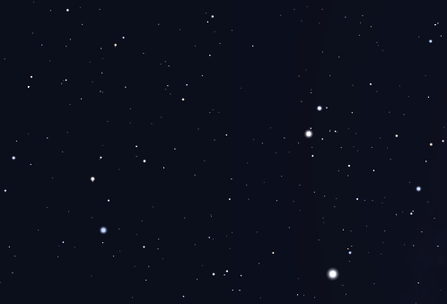

# Star Recognizer
Final Project of the discipline SCC0251/5830 Digital Image Processing

## Students
Ana Laura Chioca Vieira - 9866531 -> image enhancement and final comparison between input image and the values in the dictionary

Ana Luiza Teixeira Costa - 11218963 -> image enhancement, clustering the stars and finding the brightest stars

Flávio Salles - 11218809 -> image enhancement and drawing the lines between the brightest stars

The roles of each student were not well defined, since we coded together all the time and all the parts of the algorithm were made as a team. We tried to define the role of each one of us, however they were quite vague.

## Abstract
This project aims to recognize constellations in images of the night sky, using digital image processing thecniques.

## Step-by-step

 - Image Segmentation using a threshold, making the stars appear white and the rest of the image as black (binary image);
 - Clustering: recognizing clusters of white pixels (those are the stars!);
 - Recognizing the three brightest stars;
 - Draw a triangle whose vertices are those three brightest stars;
 - Caculate the inner angles of the triangle;
 - Compare those angles to those in a database. 
    - We used a dictionary for this. The keys are the names of the constellations and the values are the mean values of the triangle.

## Images
The sources of the pictures are various websites that focus on explaining about constellations. The input images should all be clear for better processing. We also made sure the pictures didn't have the constellations highlighted, since those are the most common images of constellations. 

### Folders
We have separated the images in folders according to the constellation they show. Some of the constellations include:

- [Cancer](Images/Cancer) 

- [Gemini](Images/Gemini) 

- [Orion](Images/Orion)

- [Scorpius](Images/Scorpius) 

- [Ursa Major](Images/UrsaMajor)

- [Ursa Minor](Images/UrsaMinor)

### Examples
Here are some exemples of the images that were used to develop and test our project. Some pictures are easier to process and others are more complex.

### Results
The results are weird...

